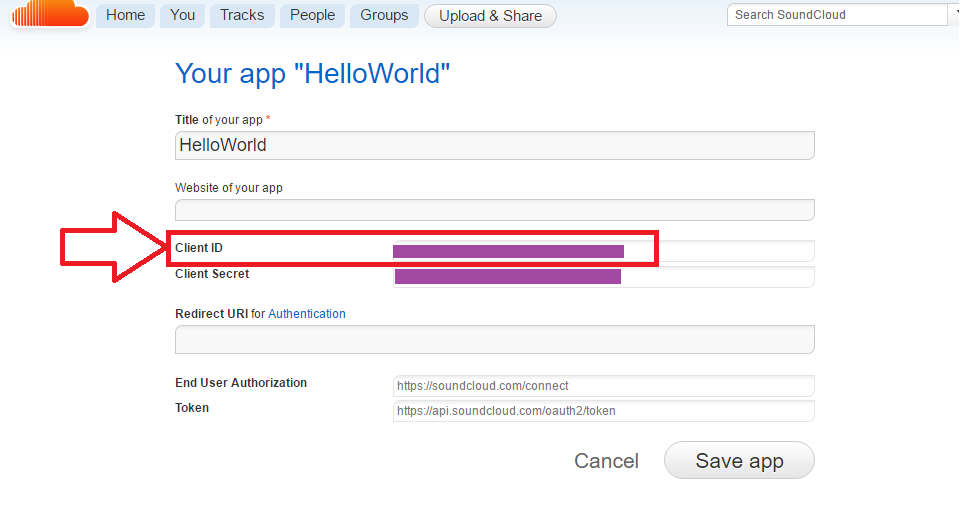

# 1. 5. TypeScript 
## Introduction
Uptil now you have been developing in JavaScript to get an understanding on web development. We want to introduce you guys to TypeScript. We believe it would help with a lot of common errors that can arise from developing in JavaScript. Those familiar with typed languages like Java, C# will have your classes back.

TypeScript is a typed superset of JavaScript that compiles to plain JavaScript. (Superset means it behaves just like JavaScript but with extra stuff) TypeScript follows similar syntax to JavaScript with the introduction of static checking and code refactoring. You basically write in TypeScript but what’s actually being run in is the generated JavaScript. This JavaScript can then still be run on any browser. 

Another superset that exist is [CoffeeScript](http://coffeescript.org/)

For this course, we will be going over the basics of TypeScript, converting our current code into TypeScript and finishing our website. 

### Disadvantages of JavaScript
* No type checking, is dynamically checked at runtime
```TypeScript
var number = 10.2;
number = "String value";
```
* No intellisense support
```TypeScript
document.getElementById("musicplayer").innerhtml = "hello"; //innerhtml doesnt exist but "innerHTML" does
```

### Benefits of TypeScript
* Object-oriented programming (OOP): work with classes and interfaces
* Optional static typing, able to specify the type of the variable 
* => Enable IDEs to provide a richer environment for spotting common errors as you type the code
* => Helps with autocompletetion of your code, with types it can help suggest more appropriate variables to pass in to a function call

## Learning Outcomes
* Learn about the basics of TypeScript 
* Learn how to watch our TypeScript files to compile to JavaScript
* Learn about Typings
* Finishing our website in TypeScript

## Resources
### Bootcamp Content
* [Slide Deck](http://link.com)
* [Video](http://link.com)


### Installation of TypeScript
If you haven't already got TypeScript installed, please refer back to [2. Development Environment](https://github.com/NZMSA/2016-Module-2/tree/master/2.%20Development%20Environment) under Tutorial 1, Setting up TypeScript.
Please also ensure you have your code up to date from the before module [4. REST APIs](https://github.com/NZMSA/2016-Module-2/tree/master/4.%20REST%20APIs)

## Basics of TypeScript

### Types

With TypeScript we can now give variables types, so that we can avoid passing the wrong type and record the intended type.
```TypeScript
var isDone: boolean = false;
var count: number = 42;
var name: string = "Deep Sea Dive";
```

If we do not the type we can assign it to `any`, this can happen when getting dynamic content. This also allows us to still work with any existing JavaScript.
```TypeScript
let notSure: any = 4;
notSure = "maybe a string instead";
notSure = false; 
```

And if you’re not familiar there is the type `void` which means nothing. This is good when functions do not return anything and just do something.
```TypeScript
function warnUser(): void {
    alert("This is my warning message");
}
```

In this sample giving the function of type non-String will cause an error when trying to compile to JavaScript
```TypeScript
function greeter(person: string) {
    return "Hello, " + person;
}

var user = [0, 1, 2];

document.body.innerHTML = greeter(user); 
```
Look out for the errors, as the JavaScript file will still be created but in this case TypeScript will warn you.
```TypeScript
greeter.ts(7,26): Supplied parameters do not match any signature of call target
```

### Interfaces
If you don’t know what an interface is, it is basically a structural type that can have properties/fields (`firstName`, `lastName`) and can have methods (`sayHello()`).
In TypeScript, two types are compatible if their internal structure is compatible. This allows us to implement an interface just by having the shape the interface requires, without an explicit implements clause.

```TypeScript
interface Person {
    firstName: string;
    lastName: string;
    sayHello(): void;
}

function greeter(person: Person) {
    return "Hello, " + person.firstName + " " + person.lastName;
}

var user = { firstName: "Jane", lastName: "User" };

document.body.innerHTML = greeter(user);
```

### Classes
TypeScript supports class-based object oriented programming. Unlike interfaces these are concrete and can be instantiated to form "objects" while interfaces cannot be.
```TypeScript
class Greeter {
    greeting: string;
    constructor(message: string) {
        this.greeting = message;
    }
    greet() {
        return "Hello, " + this.greeting;
    }
}

var greeter = new Greeter("world");
```
We can then call the method `greet()` onto our `greeter` object.
```TypeScript
var message: string = greeter.greet();
```

Of course, one of the most fundamental patterns in class-based programming is being able to extend existing classes to create new ones using inheritance. In this example it is done by extends, we can also utilize inheritance by implementing an interface.
```TypeScript
class Animal {
    name: string;
    constructor(theName: string) { this.name = theName; }
}

class Rhino extends Animal {
    constructor() { super("Rhino"); }
}
```

`super()` is used when we want to call the parent's class method instead. Here we called Animal's constructor inside of the Rhino's constructor.

## Tutorial 1: Compilation of TypeScript to JavaScript

### 1. Create a tsconfig.json file
This defines the TypeScript project settings such as the compiler options and the files that should be included.

`File --> New File --> tsconfig.json`

Our `tsconfig.json` file will look like this,
```json
{
    "compilerOptions": {
        "target": "es5",
        "module": "commonjs",
        "sourceMap": false
    }
}
```

Now when you create a `.ts` file as part of the project we will offer up rich editing experiences and syntax validation.

### 2. Compile TypeScript to JavaScript

For demonstration purpose we will just have a simple TypeScript file, `helloPerson.ts`
```TypeScript
function greeter(person: string) {
    return "Hello, " + person;
}

var user = "Deep Sea";

document.body.innerHTML = greeter(user);       
```

At the command line, run the TypeScript compiler:
```
tsc helloPerson.ts    
```

This will generate the file `helloPerson.js`.

It is obvious this can be quite tedious.

### 3. Creating a task to compile TypeScript files to JavaScript [Optional]

Open Command Palette with `Ctrl+Shift+P`

Type in `Configure Task Runner`, press Enter to select it. 
This shows a list of templates for tasks you can choose from.

Select `TypeScript - tsconfig.json`. This will create a `tasks.json` file in the workspace .vscode folder.

```
{
    // See http://go.microsoft.com/fwlink/?LinkId=733558
    // for the documentation about the tasks.json format
    "version": "0.1.0",
    "command": "tsc",
    "isShellCommand": true,
    "args": ["-p", "."],
    "showOutput": "silent",
    "problemMatcher": "$tsc"
}
```

This is just running `tsc` on our files. 

#### 3.1. To run the build task
To test our task is running, first delete the `helloPerson.js` generated from step 2.

As this is the only task in the file, you can execute it by simply pressing `Ctrl+Shift+B` (Run Build Task). At this point you will see an additional file show up in the file list `helloPerson.js`.

So each time you want to recompile your JavaScript files from your TypeScript due to changes, `Ctrl+Shift+B`

### Tutorial 2: Compilation of TypeScript to JavaScript by watching
Its a bit tedious to Run Build Task (`Ctrl+Shift+B`) each time you want to implement your new change.

Here is how "Watching" the files can be of great help.

Firstly delete our existing `tasks.json` if you created it. 

Open Command Palette with `Ctrl+Shift+P`

Type in `Configure Task Runner`, press Enter to select it. 
This shows a list of templates for tasks you can choose from.

Select `TypeScript - Watch Mode`. This will create a `tasks.json` file in the workspace .vscode folder.

```
{
    // See https://go.microsoft.com/fwlink/?LinkId=733558
    // for the documentation about the tasks.json format
    "version": "0.1.0",
    "command": "tsc",
    "isShellCommand": true,
    "args": ["-w", "-p", "."],
    "showOutput": "silent",
    "isWatching": true,
    "problemMatcher": "$tsc-watch"
}
```

This is going to monitor the project for any changes in our TypeScript files and compile them behind the scenes.

Note this is a continuous task

## Reviewing Build Issues
Sometimes builds don't go that smoothly

For example, this line of code in typescript will cause an error. (Our intellisense should tell us this!)
```
HelloWorld.ts(3,17): error TS2339: Property 'logg' does not exist on type 'Console'.
```

To review a reason why a build may have failed:

* This would show up in the output window (which can be opened using `Ctrl+Shift+U`) and selecting Tasks in the output view dropdown.
* You can click on the icon below to get a list of the problems and navigate to them.


## Tutorial 3:  Install TypeScript support for jQuery

We require TypeScript's type definition files to get tooling support for plain JavaScript. They allow you to provide type information for JavaScript code that is by itself (by its very nature) not statically typed. The file extension for such a file is `.d.ts`, where d stands for definition. 

Typings is the simple way to manage and install TypeScript definitions.

### Setting up Typings
In the terminal type:
```
npm install typings -g
```

### Acquire jQuery typings
In the terminal type:
```
typings install dt~jquery --save --global
```
The command `typings install dt~jquery --save` fetches the jQuery typings module and `--save` saves it in your `typings.json` file as a dependency.
You should see a folder in your directory called `typings` with a jQuery subfolder and a new `typings.json` (this is similar to `package.json`)

Here we get [DefinetlyTyped](http://definitelytyped.org/)'s typings of jQuery.

## Tutorial 4: Converting our JavaScript to TypeScript

### 1. Main file from basic
Lets create a new file called `main.ts` in our `js` folder, this will replace our original `basic.js` so we don’t get confused.

```TypeScript
var currentMood: Mood;

// Get elements from DOM
var pageheader = $("#page-header")[0]; //note the [0], jQuery returns an object, so to get the html DOM object we need the first item in the object
var pagecontainer = $("#page-container")[0]; 

// The html DOM object has been casted to a input element (as defined in index.html) as later we want to get specific fields that are only avaliable from an input element object
var imgSelector : HTMLInputElement = <HTMLInputElement> $("#my-file-selector")[0]; 
var refreshbtn = $("#refreshbtn")[0]; //You dont have to use [0], however this just means whenever you use the object you need to refer to it with [0].

// Register button listeners
imgSelector.addEventListener("change", function () { // file has been picked
    pageheader.innerHTML = "Just a sec while we analyse your mood...";
    processImage(function (file) { //this checks the extension and file
        // Get emotions based on image
        sendEmotionRequest(file, function (emotionScores) { //here we send the API request and get the response
            // Find out most dominant emotion
            currentMood = getCurrMood(emotionScores); //this is where we send out scores to find out the predominant emotion
            changeUI(); //time to update the web app, with their emotion!

            //Done!!
        });
    });
});

refreshbtn.addEventListener("click", function () {
    // TODO: Load random song based on mood
    alert("You clicked the button"); 
});

function processImage(callback) : void {
    var file = imgSelector.files[0];  //get(0) is required as imgSelector is a jQuery object so to get the DOM object, its the first item in the object. files[0] refers to the location of the photo we just chose.
    var reader = new FileReader();
    if (file) {
        reader.readAsDataURL(file); //used to read the contents of the file
    } else {
        console.log("Invalid file");
    }
    reader.onloadend = function () { 
        //After loading the file it checks if extension is jpg or png and if it isnt it lets the user know.
        if (!file.name.match(/\.(jpg|jpeg|png)$/)){
            pageheader.innerHTML = "Please upload an image file (jpg or png).";
        } else {
            //if file is photo it sends the file reference back up
            callback(file);
        }
    }
}

function changeUI() : void {
    //Show detected mood
    pageheader.innerHTML = "Your mood is: " + currentMood.name;  //Remember currentMood is a Mood object, which has a name and emoji linked to it. 
    //Show mood emoji
    var img : HTMLImageElement = <HTMLImageElement>  $("#selected-img")[0];//getting a predefined area on our webpage to show the emoji
    img.src = currentMood.emoji; //link that area to the emoji of our currentMood.
    img.style.display = "block"; //just some formating of the emoji's location

    //Display song refresh button
    refreshbtn.style.display = "inline";
    //Remove offset at the top
    pagecontainer.style.marginTop = "20px";
}

// Refer to http://stackoverflow.com/questions/35565732/implementing-microsofts-project-oxford-emotion-api-and-file-upload
// and code snippet in emotion API documentation
function sendEmotionRequest(file, callback) : void {
    $.ajax({
        url: "https://api.projectoxford.ai/emotion/v1.0/recognize",
        beforeSend: function (xhrObj) {
            // Request headers
            xhrObj.setRequestHeader("Content-Type", "application/octet-stream");
            xhrObj.setRequestHeader("Ocp-Apim-Subscription-Key", "d342c8d19d4e4aafbf64ed9f025aecc8");
        },
        type: "POST",
        data: file,
        processData: false
    })
        .done(function (data) {
            if (data.length != 0) { // if a face is detected
                // Get the emotion scores
                var scores = data[0].scores;
                callback(scores);
            } else {
                pageheader.innerHTML = "Hmm, we can't detect a human face in that photo. Try another?";
            }
        })
        .fail(function (error) {
            pageheader.innerHTML = "Sorry, something went wrong. :( Try again in a bit?";
            console.log(error.getAllResponseHeaders());
        });
}

// Section of code that handles the mood

//A Mood class which has the mood as a string and its corresponding emoji
class Mood {
    name: string;
    emoji: string;
    constructor(public mood, public emojiurl) {
        this.name = mood;
        this.emoji = emojiurl;
    }
}


var happy : Mood = new Mood("happy", "http://emojipedia-us.s3.amazonaws.com/cache/a0/38/a038e6d3f342253c5ea3c057fe37b41f.png");
var sad : Mood  = new Mood("sad", "https://cdn.shopify.com/s/files/1/1061/1924/files/Sad_Face_Emoji.png?9898922749706957214");
var angry : Mood = new Mood("angry", "https://cdn.shopify.com/s/files/1/1061/1924/files/Very_Angry_Emoji.png?9898922749706957214");
var neutral : Mood  = new Mood("neutral", "https://cdn.shopify.com/s/files/1/1061/1924/files/Neutral_Face_Emoji.png?9898922749706957214");


// any type as the scores values is from the project oxford api request (so we dont know the type)
function getCurrMood(scores : any) : Mood {
    // In a practical sense, you would find the max emotion out of all the emotions provided. However we'll do the below just for simplicity's sake :P
    if (scores.happiness > 0.4) {
        currentMood = happy;
    } else if (scores.sadness > 0.4) {
        currentMood = sad;
    } else if (scores.anger > 0.4) {
        currentMood = angry;
    } else {
        currentMood = neutral;
    }
    return currentMood;
}
```
This is just like our JavaScript from before in `basic.js` however we have introduced Mood as a class and able to type check our functions and characters. If by accident we try 
```TypeScript
getCurrMood("hello")
```
This time, we'd get an error when we try to compile to `.js`

Remember to relink our newly created JavaScript file (created from TypeScript compilation) back in our `index.html` and remove the link to `basic.js`
```TypeScript
<script src="./js/main.js"></script>
```
Now our code should still work like it did before, try give it a go.

## Tutorial 5: Involving SoundCloud

Now lets get to fun stuff! 
This part of the code will play songs from SoundCloud based on the mood from the picture

We'll be adding all of this at the bottom of our `main.ts` file
### 1. Adding Song Class
In this file, we'll add a `Song` class to store information about the songs we will play on soundcloud.
```TypeScript
// Section of code that handles the music and soundcloud

//A Song class which has the song's name and URL on soundcloud
class Song {
    title: string;
    url: string;
    constructor(songtitle : string, songurl : string) {
        this.title = songtitle;
        this.url = songurl;
    }
}
```
### 2. Adding Playlist Class
We will also add a Playlist class to the same file. This will hold a collection of songs for each different mood. From this playlist we can then grab a random song depending on the `mood` given
```TypeScript
//A Playlist class which holds various amount of songs for each different mood
class Playlist {
    happy: Song[];
    sad: Song[];
    angry: Song[];

    constructor() {
        this.happy = [];
        this.sad = [];
        this.angry = [];
    }

    addSong(mood : string, song : Song) : void {
        // depending on the mood we want to add it to its corresponding list in our playlist
        if (mood === "happy") {
            this.happy.push(song); // this means the value of happy of the playlist object that got invoked the method "addSong"
        } else if (mood === "sad") {
            this.sad.push(song);
        } else if (mood === "angry") {
            this.angry.push(song);
        } // do a default one as well
    }

    getRandSong(mood : string) : Song {
        if (mood === "happy" || mood === "neutral") { // we have happy and neutral as getting songs from happy
            return this.happy[Math.floor(Math.random() * this.happy.length)];
        } else if (mood === "sad") {
            return this.sad[Math.floor(Math.random() * this.sad.length)];
        } else if (mood === "angry") {
            return this.angry[Math.floor(Math.random() * this.angry.length)];
        } 
    }
}
```

### 3. Initializing playlist with songs. 

We then create a `playlist` object and populate it with various songs for different modes. Add this to  `main.ts` file. 
```TypeScript
var myPlaylist : Playlist;

function init() : void {
    // init playlist
    myPlaylist = new Playlist();

    myPlaylist.addSong("happy", new Song("Animals", "https://soundcloud.com/martingarrix/martin-garrix-animals-original")); // Song name and the url of the song on SoundCloud
    myPlaylist.addSong("happy", new Song("Good feeling", "https://soundcloud.com/anderia/flo-rida-good-feeling"));
    myPlaylist.addSong("happy", new Song("Megalovania", "https://soundcloud.com/angrysausage/toby-fox-undertale"));
    myPlaylist.addSong("happy", new Song("On top of the world", "https://soundcloud.com/interscope/imagine-dragons-on-top-of-the"));
    myPlaylist.addSong("sad", new Song("How to save a life", "https://soundcloud.com/jelenab-1/the-fray-how-to-save-a-life-7"));
    myPlaylist.addSong("sad", new Song("Divenire", "https://soundcloud.com/djsmil/ludovico-einaudi-divenire"));
    myPlaylist.addSong("sad", new Song("Stay High", "https://soundcloud.com/musaradian/our-last-night-habitsstay-hightove-lo"));
    myPlaylist.addSong("angry", new Song("When they come for me", "https://soundcloud.com/heoborus/when-they-come-for-me-linkin-park"));
    myPlaylist.addSong("angry", new Song("One Step Closer", "https://soundcloud.com/user1512165/linkin-park-one-step-closer"));
    myPlaylist.addSong("angry", new Song("Somewhere I belong", "https://soundcloud.com/mandylinkinparkmusic2xd/somewhere-i-belong"));

    // init soundcloud
    initSC();
}
```

### 4. Choose song to play based on mood
Given our mode we can then display the song and then use SoundCloud to play the song, we add the following to `main.ts` file
```TypeScript
function loadSong(currentMood : Mood) : void {
    var songSelected : Song = myPlaylist.getRandSong(currentMood.name); // gets a random song based on the moodd
    var track_url : string = songSelected.url; 

    $("#track-name")[0].innerHTML = "Have a listen to: " + songSelected.title; // display the song being played
    $("#track-name")[0].style.display = "block"; // changing this style to block makes it appear (before was set to none so it wasnt seen)
    $("#musicplayer")[0].style.display = "block";

    loadPlayer(track_url); // load soundcloud player to play this song
}
```
### 5. Setting up SoundCloud and using the player

In order to use SoundCloud we need to register and get an API key. To do so follow [SoundCloud's Register a new app](http://soundcloud.com/you/apps/new). 



Add the SoundCloud JavaScript reference to your `index.html` file
```TypeScript
<script src="https://connect.soundcloud.com/sdk/sdk-3.1.2.js"></script>
```
At the top of our `main.ts` add this line of code.
```TypeScript
declare var SC:any; // Magic - tells that there is some variable SC out there (SC is from the SoundCloud script file)
```
`SC` is from the SoundCloud JavaScript we imported, as there does not exists a typings or TypeScript version for SoundCloud we can just have a variable at the top with the name with type `any`, to not get red underlines when developing.  

We then create a function to instantiate our SoundCloud connection at the bottom of our `musichandler.ts` file. (This is called when we instantiate our playlist)
```TypeScript
var myClientId = "*****PUT YOUR SOUND CLOUD ID HERE****";

function initSC() : void {
    // init SoundCloud
    SC.initialize({
        client_id: myClientId
    });
}
```
Here `SC` is from the SoundCloud JavaScript file. 
We then want to embed the SoundCloud player in a div named `musicplayer` in our html page. Add the following function to  our `main.ts` file. (We will call this later)

```TypeScript
function loadPlayer(trackurl : string) : void {
    SC.oEmbed(trackurl, { auto_play: true }).then(function (oEmbed) {
        var div = $("#musicplayer")[0]; 
        div.innerHTML = oEmbed.html; // puts the soundcloud player inside the musicplayer div
    });
}

// Initialise playlist and soundcloud
init();
```

For further documentation about sound cloud please refer to their [API documentation](https://developers.soundcloud.com/docs/api/guide)

### 6. Changing code to utilize our new musichandler

#### 1. Invoke load song
Before our code didn’t really do much once we added a picture, all we got was an emoticon. So lets use our `loadSong()` function.

Add the call to `loadSong()` inside `main.ts` at the end of the function `processImage(function (file) {` (after `changeUI();`), 

```TypeScript
    // Load random song based on mood
    loadSong(currentMood);
```

Replace the inside of `refreshbtn.on("click", function () {` inside `main.ts` from doing nothing (giving an alert) to loading a song when we try ask for a new song

```TypeScript
    // Load random song based on mood
    loadSong(currentMood);
```

#### 3. Add div to hold our SoundCloud player

Add the following after `<div class="btn-wrapper"> ... </div`, so we can have our songs play depending on the mode. (Provided by our `loadPlayer()` function in `main.ts`)

```html
<div id="musicplayer"></div>
```

To show the song being displayed we require a header with `id="track-name"` so after `` in our `index.html` add the following line
```html
<h4 id="track-name"></h4>
```

#### 4. Add some styling

Add the following to your `style.css` just so that nothing is there when we first open our website
```css
#musicplayer{
    padding:20px;
    display:none;
}

h4#track-name {
    display:none;
}
```
### 7. Test our new website
Now once all these changes have been made, we should be done! Once uploading a picture to determine our mode our website should look like this and play a song based on our mood.


Feel free to play around and add your songs to the list.


## Completed Example
For reference, the complete solution to this demo has provided and can be found [here](demo-complete-day-two). You will need to clone or download this whole repository as a zip and open the demo-complete-day-two folder using Visual Studio Code. 
To retrieve back your `node_modules` run `npm install` and to retrieve back your `typings` run `typings install`.

You need `node_modules` for your website to run properly but `typings` just for development purposes.

To run, just use the standard `browser-sync start --server --files "**/*"` command.

### Tools
* [CodePen](http://codepen.io) - Experimenting with HTML, CSS and JS snippets. 
* [TypeScript Playground](https://www.typescriptlang.org/play/) - Experimenting with TS to JS

### Extra Learning Resources
* [TypeScript](https://www.typescriptlang.org/)
* [SoundCloud API](https://developers.soundcloud.com/docs/api/guide)
* [More about Typings](https://blog.mariusschulz.com/2014/05/19/using-typescripts-type-definition-files-to-get-tooling-support-for-plain-javascript)
