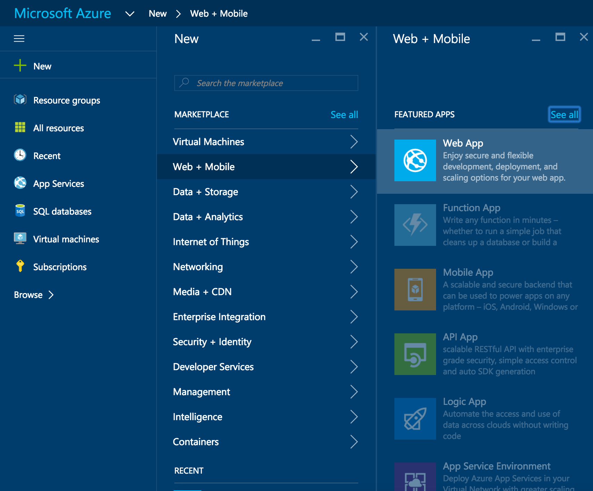
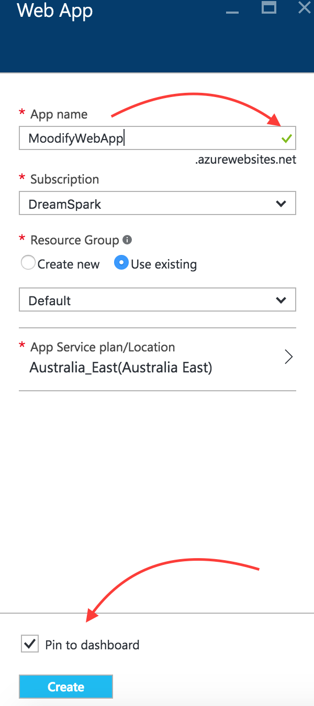
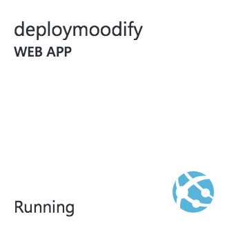
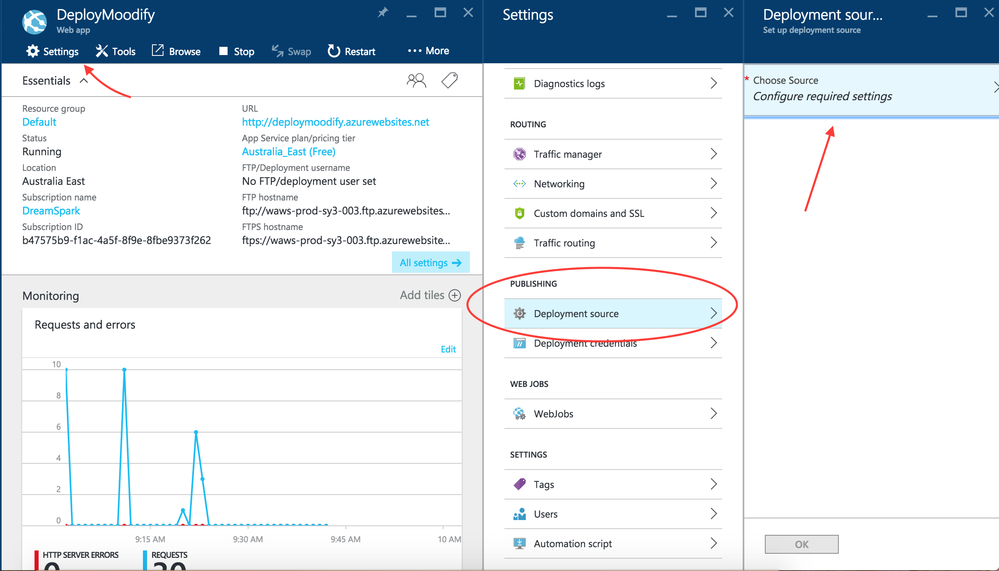
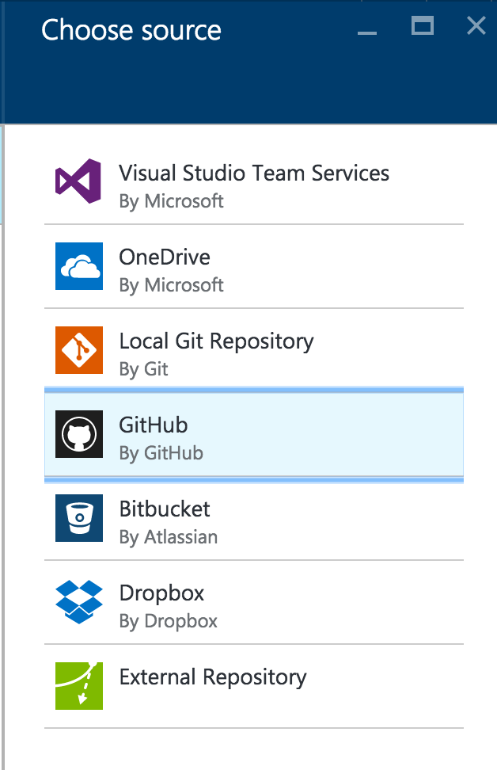
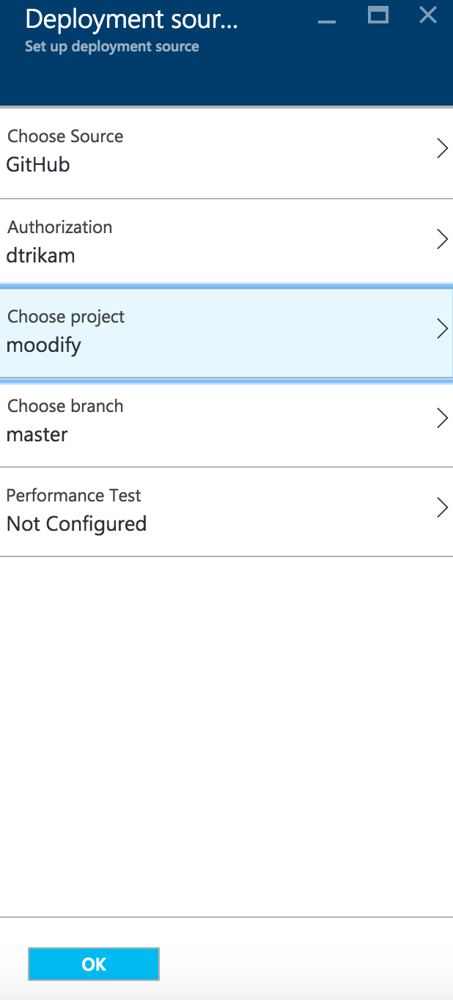
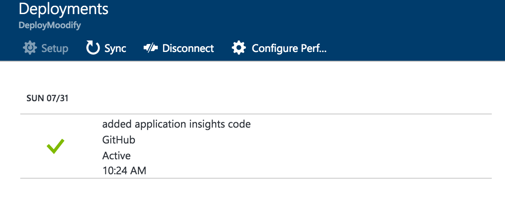
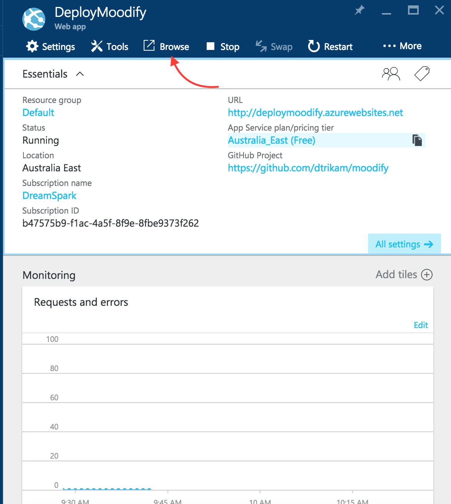

# 7. Deployment to Azure
## Introduction
In App Service, a web app is the compute resources that Azure provides for hosting a website or web application.

The compute resources may be on shared or dedicated virtual machines (VMs), depending on the pricing tier that you choose. Your application code runs in a managed VM that is isolated from other customers.

Your code can be in any language or framework that is supported by Azure App Service, such as ASP.NET, Node.js, Java, PHP, or Python. You can also run scripts that use PowerShell and other scripting languages in a web app.

This tutorial also shows you how to configure a continous deployment workflow for your Azure App Service app. App Service integration with BitBucket, GitHub, and Visual Studio Team Services (VSTS) enables a continuous deployment workflow where Azure pulls in the most recent updates from your project published to one of these services. Continuous deployment is a great option for projects where multiple and frequent contributions are being integrated.

## Learning Outcomes
* Publish your local code using continuous deployment to a web app with a unique URL that allows you to easily share it with friends and family

## Resources

### Tools
* [Visual Studio Code](https://code.visualstudio.com) - Code Editor with Git Build In 
* [Azure Portal](portal.azure.com) - Used to create web app 

### Extra Learning Resources
* [Web Apps overview](https://azure.microsoft.com/en-in/documentation/articles/app-service-web-overview/)
* [Deploy your first web app to Azure in 5 minutes](https://azure.microsoft.com/en-in/documentation/articles/app-service-web-get-started/)
* [Continuous Deployment to Azure App Service](https://azure.microsoft.com/en-in/documentation/articles/app-service-continous-deployment/)

# Publishing as a Web Application

*This tutorial assumes completion of prior modules. Before beginning ensure that you have activated your student access to azure.* 

## Lets Begin
  1. Open a web browser
  2. Go to [portal.azure.com](portal.azure.com)
  3. Log in with the credentials that you activated your dream spark account with

## Creating a new Web App
  1. Click on "New" in the top left corner of the portals home page
  2. Click on "Web + Mobile" under the Market Place heading
  3. Click on "Web App"

  4. Fill out the information about your web app
    - Note you should get a tick next to your "App Service Name"
    - To access the website once completed you will go to yourWebAppsName.azurewebsites.net
  5. For the "Resource Group", select "Use Existing" and choose "Default" option in the dropdown menu
  6. Click on **Create** at the bottom  

##### Azure is now deploying the Web App in the background
##### Whilst waiting open the Construct 2 application with the game you would like to deploy

## Setting up continuous deployment
  1. Head back over to your dashboard and find the tile with your App Name and click it.

  2. Next find settings in the top left 
  3. Click Deployment Source in the publishing group
  4. Click configure required settings in the new menu as shown below

  5. Choose GitHub in the menu that shows up  

  6. Be sure to authorize GitHub to your account
  7. Choose the project you want to link to this WebApp from your GitHub Repo
  8. Choose the Branch that you want to deploy from

  9. Go ahead and click **OK**

## Browsing your WebApp

Now it is time to test your site.

Click **Browse** as shown in the figure below, this will open up a new tab which will allow you to share this link with friends and family and let them enjoy your Web App as well.

#### Congratulations you have successfully created a Web App and published it to Azure
#### Any changes you push to the connected GitHub repo will now automatically get published to the link you have created "yourWebAppName.azurewebsites.net"
