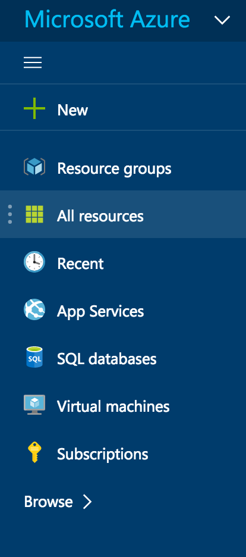
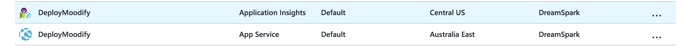
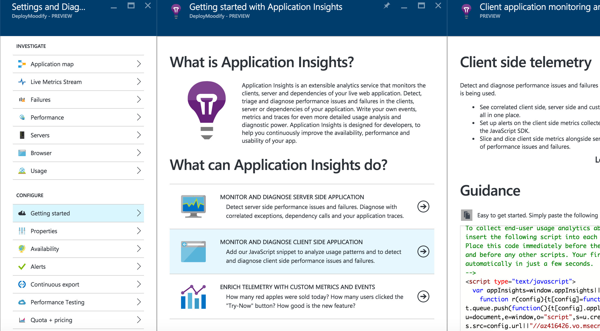

# 7. Deployment to Azure
## Introduction
In the Azure Portal you can set up monitoring to collect the statistics and details on the application dependencies in your Azure web apps or virtual machines.

Azure supports Application Performance Monitoring (APM) by leveraging extensions. These extensions are installed into your application and collect the data and report back to the monitoring services.

Application Insights and New Relic are two of the performance monitoring extensions that are available. To use them, you install an agent at runtime. With Application Insights, there's also the option to build your code with an SDK. The SDK lets you write code to monitor the usage and performance of your app in more detail.

## Learning Outcomes
* Be able to implement application in your Web Application 
* Learn about why analytics information is useful to you, as a developer

## Resources

### Tools
* [Visual Studio Code](https://code.visualstudio.com) - Code Editor with Git Build In 
* [Azure Portal](portal.azure.com) - Used to create web app 

### Extra Learning Resources
* [Application Insights Animated Introduction](https://www.youtube.com/watch?v=fX2NtGrh-Y0)
* [Application Insights for web pages](https://azure.microsoft.com/en-gb/documentation/articles/app-insights-javascript/)
* [Application Insights - introduction](https://azure.microsoft.com/en-us/documentation/articles/app-insights-overview/)

# Publishing as a Web Application

*This tutorial assumes completion of prior modules. Before beginning ensure that you have activated your student access to azure.* 

## Lets Begin
  1. Open a web browser
  2. Go to [portal.azure.com](portal.azure.com)
  3. Log in with the credentials that you activated your dream spark account with

## Setting up Application Insights
  1. Find **All resources** on the left



  2. Find your App Name with the type Application Insights and click it



  3. Next click settings


  4. Find **Getting started** under the **CONFIGURE** group
  5. Click **MONITOR AND DIAGNOSE CLIENT SIDE APPLICATION**

 

  6. Paste the code from your azure portal into your index.html (master page), similar to that below but with your unique **instrumentationKey**

  ```html
  <!-- 
To collect end-user usage analytics about your application, 
insert the following script into each page you want to track.
Place this code immediately before the closing </head> tag,
and before any other scripts. Your first data will appear 
automatically in just a few seconds.
-->
<script type="text/javascript">
  var appInsights=window.appInsights||function(config){
    function r(config){t[config]=function(){var i=arguments;t.queue.push(function(){t[config].apply(t,i)})}}var t={config:config},u=document,e=window,o="script",s=u.createElement(o),i,f;s.src=config.url||"//az416426.vo.msecnd.net/scripts/a/ai.0.js";u.getElementsByTagName(o)[0].parentNode.appendChild(s);try{t.cookie=u.cookie}catch(h){}for(t.queue=[],i=["Event","Exception","Metric","PageView","Trace","Dependency"];i.length;)r("track"+i.pop());return r("setAuthenticatedUserContext"),r("clearAuthenticatedUserContext"),config.disableExceptionTracking||(i="onerror",r("_"+i),f=e[i],e[i]=function(config,r,u,e,o){var s=f&&f(config,r,u,e,o);return s!==!0&&t["_"+i](config,r,u,e,o),s}),t
    }({
        instrumentationKey:"XXXXX-XXXXX-XXXXX-XXXX-XXXXX"
    });
       
    window.appInsights=appInsights;
    appInsights.trackPageView();
</script>
```


#### Congratulations you have successfully integrated Application insights into your Web Application 
